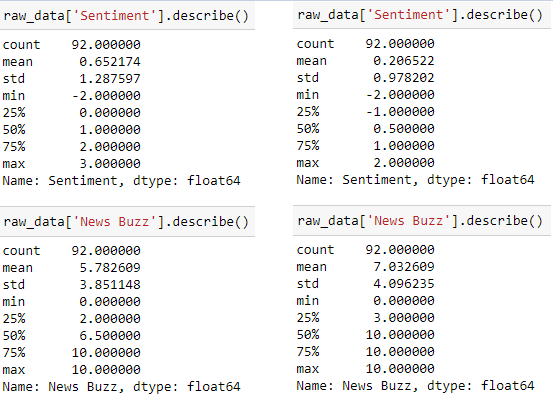
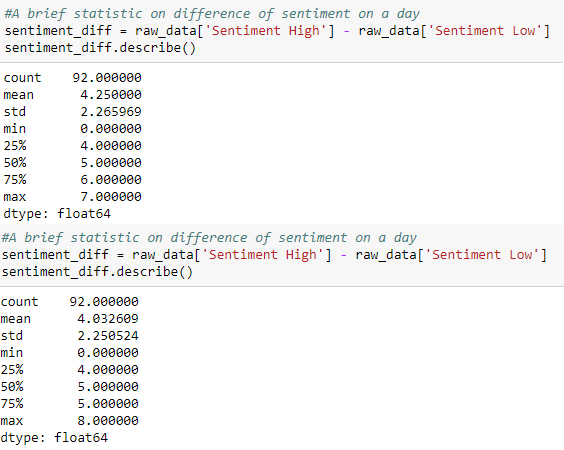
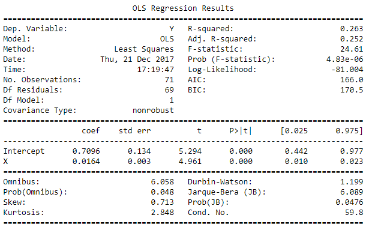
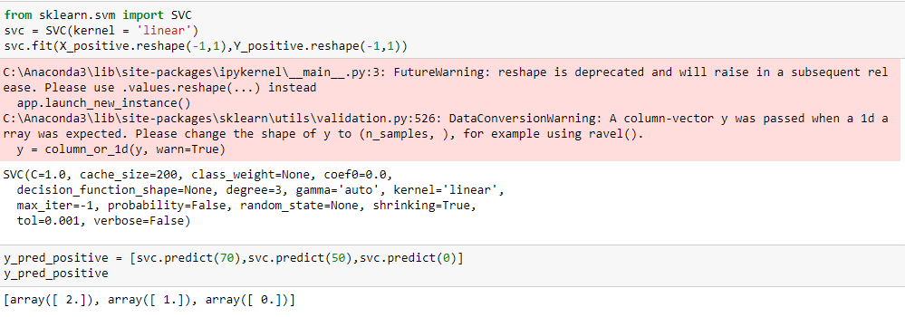

# Analysis report on Apple Inc(US) and Twitter 

=================================================================================

- Prepared by : Khew Min Shiu
- Mail : minshiu95@gmail.com


The codes is submitting in Ipython Notebook format, but I have created another copy named `codes.py` for backup purpose.
*For convenient purpose, I will call AAPL_US just as `Apple`.
<br>*Sorry for not justifying the paragraph below. I tried but it doesn't work at all. 

=================================================================================
<div style="text-align:justify">
I have extracted NS1/AAPL_US and NS1/TWTR_US to perform analysis and do comparison.
First, I perform simple statistic on `Sentiment` and `News Buzz` variable. The results are shown below:


<div style="text-align:center">Figure 1: (Left) Descriptive statistic of Apple_US (Right) Descriptive statistic of Twitter </div>
<br>
From the above statistic, we can see that `Apple` has higher mean value on 'Sentiment' variable. However, it has a higher standard deviation. It suggests that even `Apple` has relatively higher mean, but it's sentiment data leverage much from the mean point, which is a sign of unstability on sentiment values. Besides that, we can see that the range of 'Sentiment' of `Apple` is from -2 to 3, but from -2 to 2 in `Twitter`, which further support my previous argument. So in terms of market price changes, maybe we can say that `Apple` has a better market price due to its higher mean value on 'Sentiment', but `Twitter` is more stable on its prices due to its lower standard deviation value.

For 'News Buzz', the situation reverse. `Twitter` has a higher mean value but lower standard deviation. However, 'News Buzz' is just indicates it's news volume, but the news can be either positive and negative. So, it is nearly the popularity of an asset on social media and hence we couldn't infer to market prices. We could only say that more peoples are talking on `Twitter` than `Apple` in the past 3 months.

<hr></hr>


<div style="text-align:center">Figure 2: (Top) Sentiment differences of Apple_US (Bottom) Sentiment differences of Twitter </div>
<br>
This part is just another small statistics. The statistic above shows the comparison about the differences of 'Sentiment High' and 'Sentiment Low' on 2 companies. So for a particular day, the sentiment differences of `Apple` will be slightly higher, which suggests again the unstability of sentiment values on `Apple` than `Twitter`.

<hr></hr>

Besides of conducting descriptive statistic, I do a small calculation on positive sentiment values. For `Apple` , in the past 3 monthrs, there is a total of 53 positive sentiment values and 39 negative sentiment values. Meanwhile, `Twitter` has 46 positive sentiment values and 46 negative sentiment values. It is obvious that `Apple` currently has a better bullishness than `Twitter`, which we may predict that `Apple` has actulaly a better market prices in recent 3 months. Moreover, there are 4 days in previous 3 months that `Apple`'s 'Sentiment Low' value is higher than 0, but only 3 days for `Twitter`. Another sides note is that `Apple` has 1 day that 'Sentiment High' value is lower than 0, but 2 days for `Twitter`. These records further support my argument.

<hr></hr>

A small interesting I observed is that there is 18 days that `Apple` has zero sentiment and buzz and 16 days for `Twitter`. I can't say much on this phenomenon. It might be the system maintence which affect data retrieval, but also might be that not much people talking on this 2 assets for these days.

<hr></hr>

After these descriptive analysis, I perform simple machine learning on data 'Sentiment' and 'News Volume'. The reason that I used only these 2 columns is because I think that 'Sentiment High' and 'Sentiment Low' has a similar content with 'Sentiment', so they might not affect the quality of the model. The same thing apply to 'News Volume' and 'News Buzz'. I test it with 2 models, the ordinary least square regression model and SVC model with linear kernel.

A small trick that I done is to seperate the data into 2 groups. One of them consist of positive sentiment values and another for negative sentiment values. I don't want to mix all data together to build the model since it won't works. The news volume is not directly proportional to the sentiment value. A high news volume doesn't mean to have a high sentiment value. It could be negative sentiment.

So, for each asset, I built 2 models. One is for predicting positive sentiment value and another is for predicting negative sentiment value, by using news volume.


<div style="text-align:center">Figure 3 : Ordinary least square regression model summary. (Apple_US) </div>
<br>
If we let Y be the sentiment value and X be the news volume, then model has the equation ```Y = 0.7086 + 0.0164X```. There is another negative model, which has the equation of ```Y = -1.3353 + 0.0044X```. So for example, if today we have `X=10`, we may predict the sentiment value to be 0.8726 or -1.2913.

For `Twitter`, we have ```Y = 0.5629 + 0.002X``` for positive prediction and ```Y = -1.1437 + 0.0009X``` for negative prediction.

Besides of OLS, the result of SVM is very straight forward. There are also 2 models for each asset.


<div style="text-align:center">Figure 4 : SVM model summary. (Apple_US) </div>
<br>
The result is shown on the bottom part. This is an example for positive prediction. It's obvious that if we have `X=70` then `Y=2`, `X=50, Y=1` and `X=0, Y=0`. We can predict sentiment value using any news volume value.

<hr></hr>

As a conclusion, I predict that `Apple` has a relative high market prices than `Twitter` for the past 3 months based on the sentiment data analysis. However, `Apple` shows more unstability in sentiment and it might indicate a higher risk on this company.

</div>
